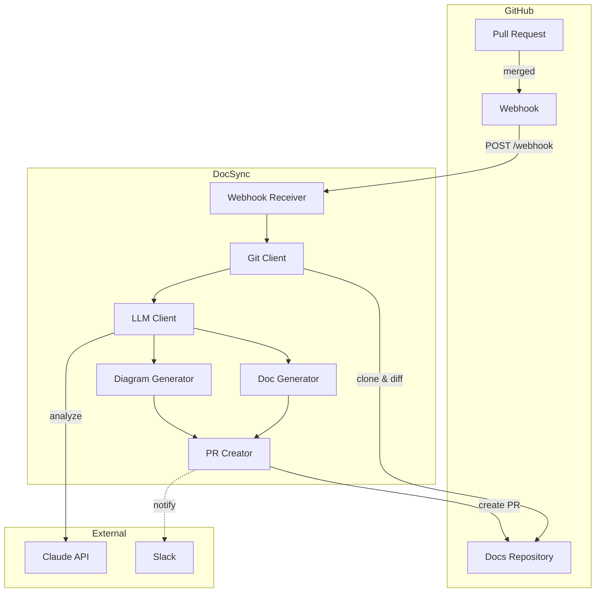

# DocSync

Automated documentation generator triggered by merged PRs with C4 diagram support.

## Overview

DocSync is a service that automatically generates and updates documentation when pull requests are merged. It analyzes code changes using LLM, generates relevant C4 diagrams in Mermaid format, and opens a documentation PR for developer review.

## Features

- **Webhook Integration** - Listens for GitHub PR merge events
- **LLM-Powered Analysis** - Analyzes code diffs to understand changes using Claude
- **C4 Diagram Generation** - Creates Context, Container, and Component level diagrams
- **Automated PR Creation** - Opens documentation PRs with assigned reviewers
- **Retry Logic** - Exponential backoff with jitter for resilient API calls
- **Structured Logging** - JSON-formatted logs for easy parsing and monitoring
- **Optional Slack Notifications** - Get notified when docs PRs are created

## Architecture



## Project Structure

```
src/
├── config/         # Configuration management (Zod validation)
├── errors/         # Custom error classes and retry logic
├── webhook/        # GitHub webhook receiver (Express)
├── git/            # Git client for repo operations (simple-git)
├── llm/            # LLM client (Anthropic Claude)
├── docs/           # Documentation generation and templates
├── diagrams/       # C4 diagram generation (Mermaid)
├── pr/             # PR creation and management
└── index.ts        # Application entry point
```

## Getting Started

### Prerequisites

- Node.js 20+
- GitHub Personal Access Token (with `repo` scope) or GitHub App
- Anthropic API key

### Installation

```bash
git clone https://github.com/your-org/docsync.git
cd docsync
npm install
```

### Configuration

1. Copy the example environment file:
   ```bash
   cp .env.example .env
   ```

2. Edit `.env` with your values (see [Configuration Reference](#configuration-reference) below)

3. Build and start:
   ```bash
   npm run build
   npm start
   ```

### Development

```bash
npm run dev      # Start with hot reload
npm test         # Run tests
npm run lint     # Run ESLint
```

## Configuration Reference

| Variable | Required | Default | Description |
|----------|----------|---------|-------------|
| `PORT` | No | `3000` | Server port |
| `WEBHOOK_SECRET` | Yes | - | GitHub webhook secret for signature verification |
| `GITHUB_TOKEN` | Yes | - | GitHub PAT with `repo` scope |
| `GITHUB_APP_ID` | No | - | GitHub App ID (alternative to PAT) |
| `GITHUB_PRIVATE_KEY` | No | - | GitHub App private key |
| `LLM_PROVIDER` | No | `anthropic` | LLM provider (`anthropic` or `openai`) |
| `LLM_API_KEY` | Yes | - | API key for the LLM provider |
| `LLM_MODEL` | No | `claude-sonnet-4-20250514` | Model to use for analysis |
| `DOCS_REPO_OWNER` | Yes | - | Owner of the documentation repository |
| `DOCS_REPO_NAME` | Yes | - | Name of the documentation repository |
| `DOCS_REPO_BRANCH` | No | `main` | Base branch for documentation PRs |
| `SLACK_WEBHOOK_URL` | No | - | Slack webhook URL for notifications |
| `SLACK_CHANNEL` | No | - | Slack channel override |
| `SLACK_ENABLED` | No | `false` | Enable/disable Slack notifications |

## GitHub Webhook Setup

1. Go to your repository's **Settings > Webhooks > Add webhook**

2. Configure the webhook:
   - **Payload URL**: `https://your-domain.com/webhook`
   - **Content type**: `application/json`
   - **Secret**: Same value as `WEBHOOK_SECRET` in your config
   - **Events**: Select "Pull requests"

3. Save the webhook

4. Test by merging a PR - DocSync will process the event and create a documentation PR

## How It Works

1. **Webhook Received** - When a PR is merged, GitHub sends a webhook event to DocSync
2. **Signature Verified** - The webhook signature is validated using HMAC-SHA256
3. **Repository Cloned** - DocSync clones the repository to analyze the changes
4. **Diff Analyzed** - The code diff is sent to Claude for analysis
5. **Docs Generated** - Based on the analysis, documentation is generated/updated
6. **Diagrams Created** - C4 diagrams are generated if architectural changes detected
7. **PR Created** - A documentation PR is created with all changes
8. **Notification Sent** - Optional Slack notification is sent

## Error Handling

DocSync includes comprehensive error handling with automatic retries:

- **Git Operations** - Retried on transient failures (network issues, etc.)
- **LLM API Calls** - Retried on rate limits (429) and server errors (5xx)
- **PR Creation** - Retried on GitHub API failures

Retry behavior:
- Maximum 3 retries (configurable)
- Exponential backoff: 1s, 2s, 4s...
- Jitter: +/- 30% to prevent thundering herd

## Troubleshooting

### Webhook not receiving events

1. Check the webhook URL is publicly accessible
2. Verify the webhook secret matches your `WEBHOOK_SECRET`
3. Check GitHub webhook delivery logs for errors
4. Ensure the webhook is configured for "Pull requests" events

### LLM API errors

1. Verify your API key is valid and has sufficient credits
2. Check if you're hitting rate limits (429 errors)
3. Try a different model if the current one is unavailable

### PR creation fails

1. Verify the GitHub token has `repo` scope
2. Check if the target repository exists
3. Ensure the base branch exists in the target repo
4. Check for branch protection rules that may block pushes

### Signature verification fails

1. Ensure the webhook secret in GitHub matches `WEBHOOK_SECRET`
2. Check that the payload is being parsed correctly
3. Verify the `x-hub-signature-256` header is present

## API Reference

### POST /webhook

Receives GitHub webhook events.

**Headers:**
- `x-hub-signature-256`: HMAC-SHA256 signature of the payload
- `x-github-event`: Event type (must be `pull_request`)
- `content-type`: `application/json`

**Response:**
- `200 OK` - Event processed or ignored
- `401 Unauthorized` - Invalid or missing signature
- `500 Internal Server Error` - Processing failed

## Contributing

See [CONTRIBUTING.md](CONTRIBUTING.md) for guidelines on contributing to this project.

## License

MIT
